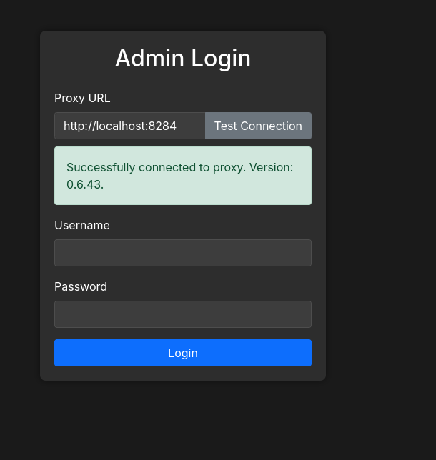
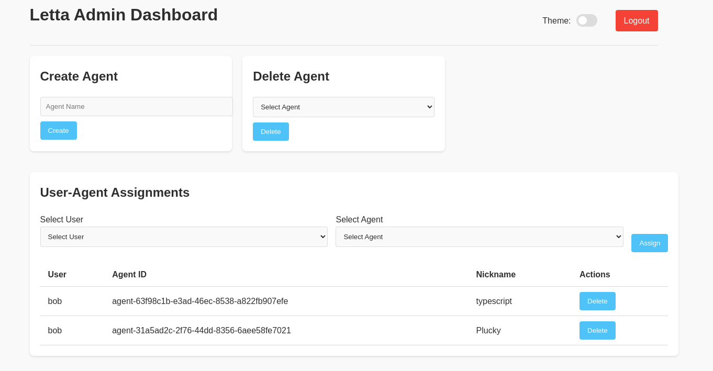
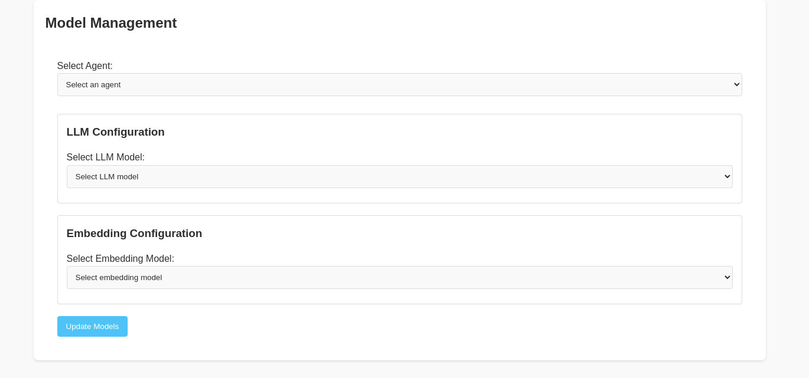
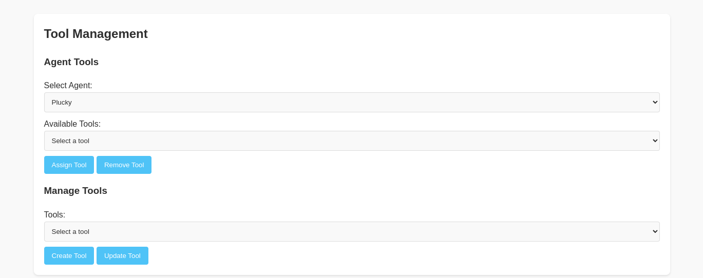
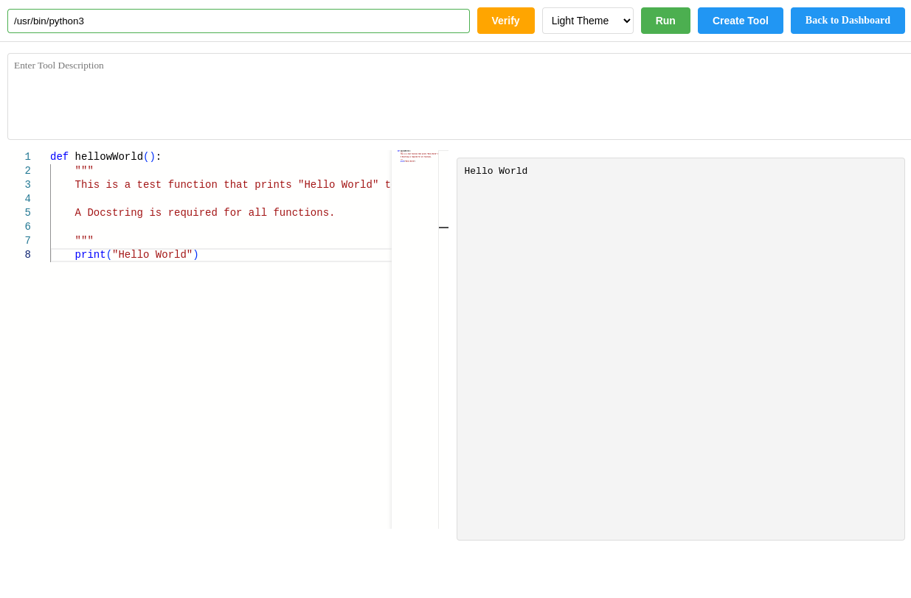
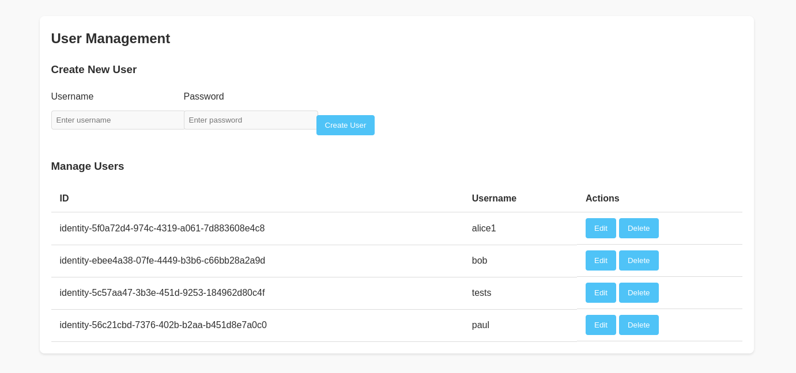

# Admin Interface

This is the beginning of an Admin Interface to the Letta platform and is not for production use yet. It provides functionalities for user authentication, session management, managing agents, users, and tools.

I created this to simplify navigating around and working with agents, identities, and various tasks. I tend to add a function to the admin interface if I start using it often in the ADE interface.

Program was pair programmed with AI for the UI and debugging.

This project is not associated with the Letta platform.

## Prerequisites

- Python 3.9 or higher
- Docker and Docker Compose
- Git
- Letta Instance (<https://github.com/letta-ai/letta>)

## Installation

1. Clone the repository:

```bash
git clone https://github.com/thedunston/letta-admin-interface.git
cd letta-admin-interface
```

2. Create and activate a virtual environment:

```bash
python -m venv venv
source venv/bin/activate  # On Windows: venv\Scripts\activate
```

3. Install dependencies:

```bash
pip install -r requirements.txt
```

## Docker Setup

The project includes Docker configurations for different environments:

### Directory Structure

```
docker/
├── proxy/          # Proxy-only configuration
├── full/           # Full application (proxy + admin)
└── dev/            # Development environment
```

### Using tasks.py

The project includes a task runner script (`tasks.py`) to simplify Docker operations:

```bash
# Run only the proxy service
./tasks.py proxy

# Run the full application (proxy + admin)
./tasks.py full

# Run the development environment
./tasks.py dev

# Stop containers
./tasks.py down [env]  # env: proxy, full, or dev

# View logs
./tasks.py logs [env] [service]  # env: proxy, full, or dev

# Build containers
./tasks.py build [env]  # env: proxy, full, or dev

# Show help
./tasks.py help
```

The script will automatically:

1. Check if the required proxy image exists
2. If not, clone and build the proxy from the official repository (<https://github.com/ahmedrowaihi/letta-pproxy>)
3. Run the requested Docker environment

### Manual Docker Commands

If you prefer to use Docker commands directly:

```bash
# Run proxy only
docker-compose -f docker/proxy/docker-compose.yml up

# Run full application
docker-compose -f docker/full/docker-compose.yml up

# Run development environment
docker-compose -f docker/dev/docker-compose.yml up
```

## Development

### Running Locally

1. Start the proxy service:

```bash
./tasks.py proxy
```

2. In a new terminal, run the admin interface:

```bash
python run.py
```

The admin interface will be available at <http://localhost:8285>

### Environment Variables

Key environment variables:

- `PROXY_URL`: URL of the proxy service (default: <http://localhost:8284>)
- `ADMIN_INTERFACE_DEBUG`: Enable debug mode (default: True)
- `SECRET_KEY`: Flask secret key (default: 'dev')
- `LETTA_SERVER_PASSWORD`: Server password for authentication

## Security

- All code execution is performed in isolated environments
- Session management with secure cookie settings
- Input validation and sanitization
- Rate limiting on sensitive endpoints
- Proxy authentication required for API access

## Contributing

1. Fork the repository
2. Create a feature branch
3. Commit your changes
4. Push to the branch
5. Create a Pull Request

## License

This project is licensed under the MIT License - see the LICENSE file for details.

## Dependencies

- Python 3.9+
- Flask 3.1.0+
- Flask-CORS 5.0.1
- Werkzeug 3.1.3
- Requests 2.27.1+

## Usage

The program requires the use of a proxy since it will be redirecting queries to another host that is different than it's default URL:port. See Ahmed's proxy at <https://github.com/ahmedrowaihi/letta-pproxy>, which includes a docker container.

You will first need to create an identity and give it the Org type of "Organization." This program uses that identity type as an administrator.

In the ADE editor, click on an identity's  `view/edit` (button or create an identity first) and then select the `TYPE` and set it to `Organization`. Under `IDENTITY PROPERTIES`  click the `+` and set the key to `password` and value to a hashed SHA256 password (see below). Add a new key called `token` and add `GENERATED_AFTER_LOGIN` (though that key:value pair is not yet used).

Create a property with the key `password` and the hashed password as the value. A script `adminpass.py` is provided to generate a sha256 hash.

If running locally:

```bash
python app/utils/adminpass.py
```

If running with Docker:

```bash
docker compose exec -it admin-interface python app/utils/adminpass.py
```

Example output:

```bash
Enter password: 
Verify password: 

SHA256 Hash: 1f59bdb91fc2df356bee74caec2eeb9d50269650bbceecaa50cbf9bc4924105f
```

Set the result to the value of the "hash" key. Then login using the

**Access the application**: Open your web browser and navigate to `http://localhost:8285` and login using the password set with the script `adminpass.py` script above and the user `identity` created with the `Organization` role.

## Project Structure

```
app/
├── __init__.py          # Application factory
├── config/             # Configuration settings
├── auth/               # Authentication module
├── core/               # Core functionality
├── routes/             # Route handlers
├── static/             # Static files (CSS, JS, images)
│   └── assets/        # Image assets
├── templates/          # HTML templates
│   └── admin/         # Admin interface templates
└── utils/             # Utility scripts
```

## Screenshots



**Agent Management**


**Model Management**


**Tool Management**


**Create a Tool Editor**


**User Management**

