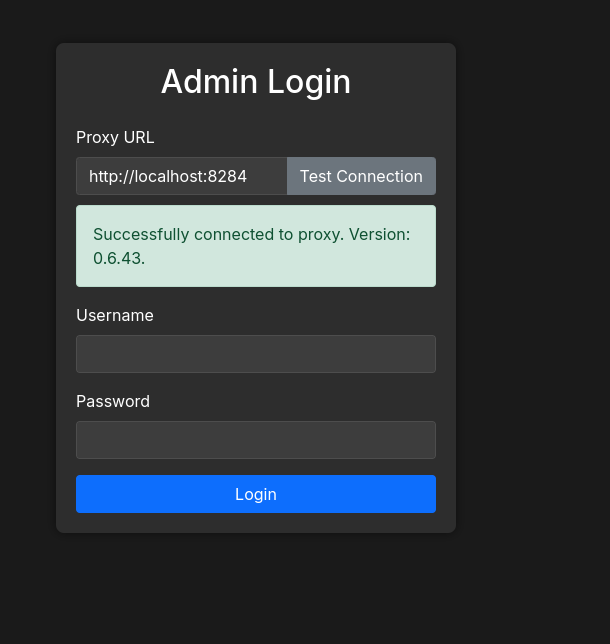
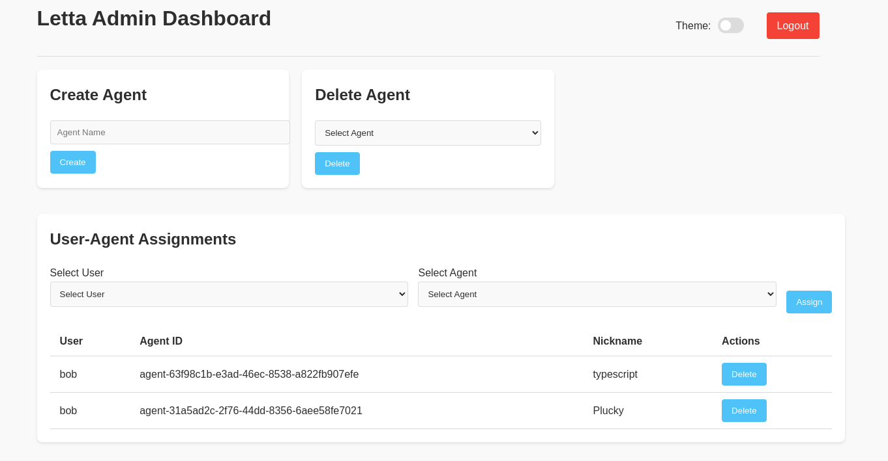
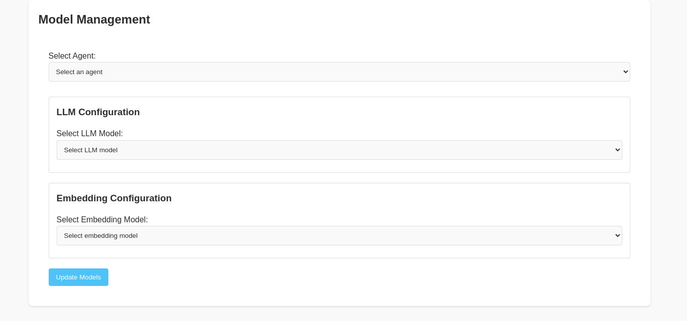
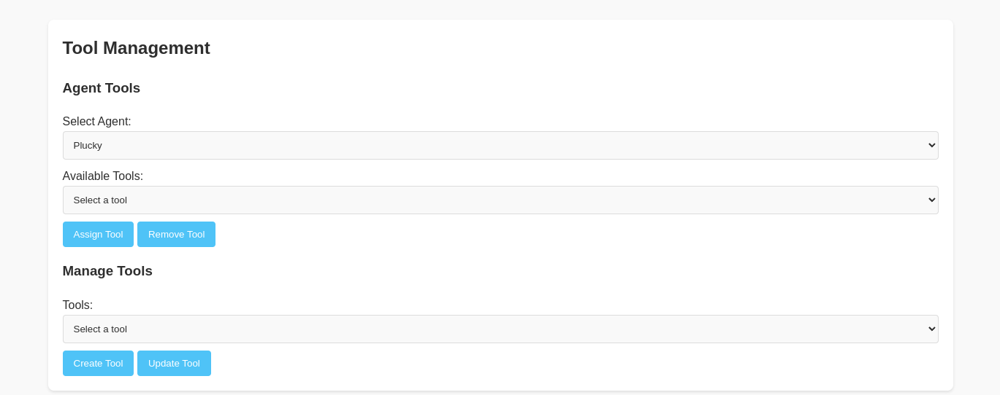
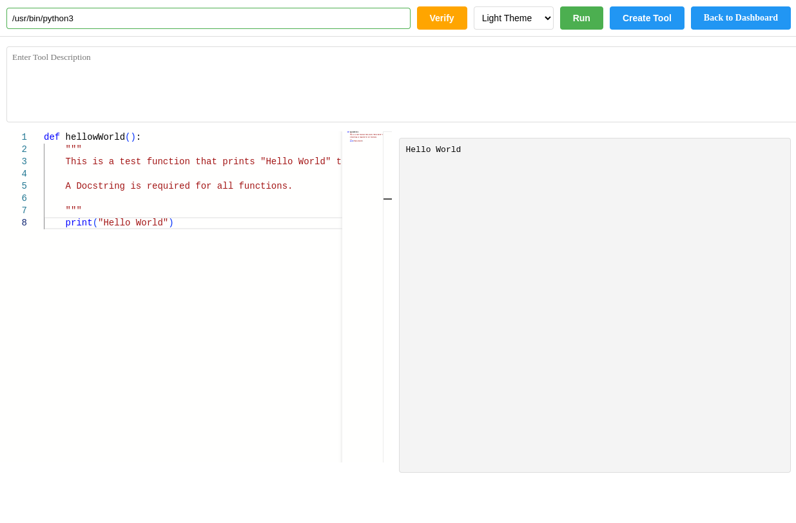
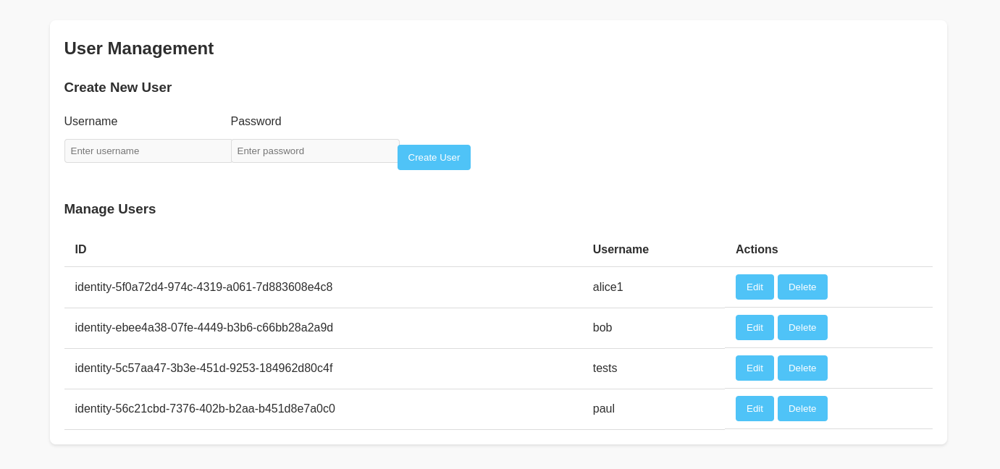

# Admin Interface

## Overview

This is the beginning of an Admin Interface to the Letta platform and is not for production use yet. It provides functionalities for user authentication, session management, managing agents, users, and tools.

I created this to simplify navigating around and working with agents, identities, and various tasks. I tend to add a function to the admin interface if I start using it often in the ADE interface.

Program was pair programmed with AI for the UI and debugging.

This project is not associated with the Letta platform.

## Dependencies

## Installation

To set up the project, follow these steps:

1. **Clone the repository**:
   ```bash
   git clone https://github.com/thedunston/letta-admin-interface.git
   cd letta-admin-interface
   ```

2. **Create a virtual environment** (optional but recommended):
   ```bash
   python -m venv letta-admindev
   source letta-admindev/bin/activate
   ```

3. **Install the dependencies**:
   ```bash
   pip install -r requirements.txt
   ```

4. **Run the application**:
   ```bash
   python admin_interface.py
   ```


## Usage

The program requires the use of a proxy since it will be redirecting queries to another host that is different than it's default URL:port. See Ahmed's proxy at https://github.com/ahmedrowaihi/letta-pproxy, which includes a docker container.

You will first need to create an identity and give it the Org type of "Organization." This program uses that identity type as an administrator.

In the ADE editor, click on an identity's  `view/edit` (button or create an identity first) and then select the `TYPE` and set it to `Organization`. Under `IDENTITY PROPERTIES`  click the `+` and set the key to `password` and value to a hashed SHA256 password (see below). Add a new key called `token` and add `GENERATED_AFTER_LOGIN` (though that key:value pair is not yet used).

Create a property with the key `password` and the hashed password as the value. A script `adminpass.py` is provided to generate a sha256 hash.

```bash
python adminpass.py

python3 adminpass.py 
Enter password: 
Verify password: 

SHA256 Hash: 1f59bdb91fc2df356bee74caec2eeb9d50269650bbceecaa50cbf9bc4924105f
```

Set the result to the value of the "hash" key. Then login using the

**Access the application**: Open your web browser and navigate to `http://localhost:8285` and login using the password set with the script `adminpass.py` script above and the user `identity` created with the `Organization` role.

## Screenshots



**Agent Management**


**Model Management**


**Tool Management**


**Create a Tool Editor**


**User Management**

